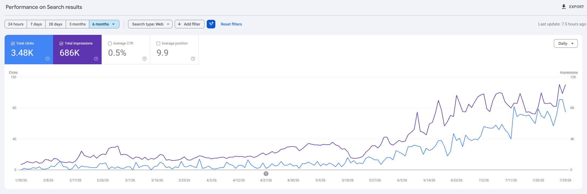
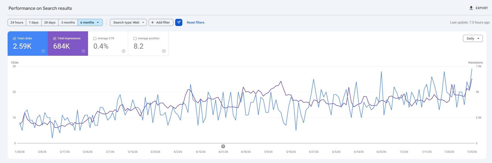
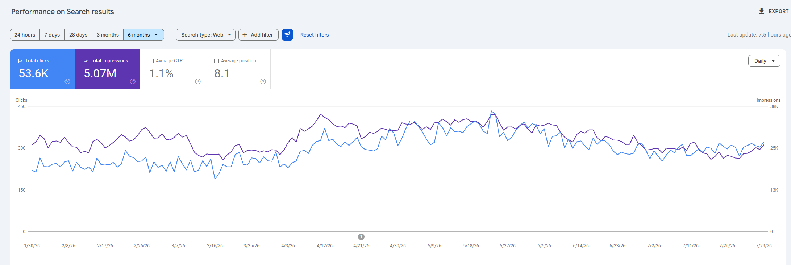

<p align="center">
  
  
  
  
</p>

<h1 align="center">玄染 SEO 博客写手（Xuanran SEO Blog Writer）</h1>

<p align="center">
  <strong>面向 Claude Code 的生产级 SEO + GEO 内容工厂</strong><br/>
  调研 → 撰写 → 事实核查 → 优化 → 发布 → 监测，同时打赢
  <b>Google 与 AI 搜索双战场</b> —— ChatGPT、Perplexity、Claude、Gemini、Google AI Overviews
</p>

<p align="center">
  由 <a href="https://loamwrightseo.com/"><b>沃匠（Loamwright）</b></a> 开源 ——
  这家 SEO 机构每天在生产环境跑它，创始人 <b>Lewei Zhang</b>
</p>

<p align="center">
  <a href="README.md">English</a> &nbsp;|&nbsp; <b>简体中文</b>
</p>

<p align="center">
  <a href="#快速开始">快速开始</a> &bull;
  <a href="#流水线">流水线</a> &bull;
  <a href="#功能亮点">功能亮点</a> &bull;
  <a href="#架构">架构</a> &bull;
  <a href="#质量闸门">质量闸门</a> &bull;
  <a href="#硬规则">硬规则</a> &bull;
  <a href="#公开仓库里有什么">公开仓库</a> &bull;
  <a href="#参与贡献">参与贡献</a>
</p>

---

## 这是什么？

一个 Claude Code 插件：一条命令 —— `/article "你的关键词"` —— 产出一篇完成调研、
带真实引用、去 AI 味、完成视觉排版、注入结构化数据的长文，以草稿状态发布到
WordPress 并对线上 URL 做逐项验证。它由 [沃匠（Loamwright）](https://loamwrightseo.com/)
在真实代理业务的 **13 个站点组合**上打磨而成（公开代码树中第三方客户标识均已匿名化为
稳定的 `project-*` 别名；沃匠自有站点以真名出现），每一条硬规则背后都是一次真实的
生产事故。

同一个插件内置两个独立入口：

- **内容工厂** —— `/article` 流水线（5 个阶段，45 级确定性编排状态机）
- **网站审计** —— `/website-audit` 爬取最多 500 页，并行派出 15 个专项审计代理

## 效果如何？

半年时间、**几十个网站**的生产实测——全程**不做任何外链**——仅靠内容本身，
Google Search Console 里的点击（clicks）与展示（impressions）持续**线性上升**。
三个站点组合里的实例（6 个月窗口，Daily 视图，站点名隐去）：

**新站从零起飞** —— 3.48K 点击 · 686K 展示：



**稳定线性爬升** —— 2.59K 点击 · 684K 展示：



**规模化站点** —— 53.6K 点击 · 5.07M 展示：



欢迎你在自己的站点上实测。

## 一览

| 组件 | 数量 |
|:---|:---|
| 编排技能（L1/L2） | **8** |
| 原子子技能（L3） | **67** |
| 最小工具隔离子代理（L4） | **34** |
| Python 工具脚本（L5） | **230+** |
| 文章格式模板 | **27** |
| RAG 知识参考文档 | **102** |
| JSON Schema 契约 | **22** |
| 流水线阶段（确定性状态机） | **45** |
| 渲染 lint 泄漏类别 | **13**（L1–L13） |
| 发布后线上 URL 检查 | **29** |
| 源自生产事故的硬规则 | **14** |

---

## 快速开始

```bash
# 1. 安装进 Claude Code
/plugin install /path/to/xuanran-seo-blog-writer/

# 2. 初始化一个项目（不限行业 —— 向导会自动识别业务原型）
/init https://your-website.com
#  → 交互式配置：品牌语气、产品、竞品、GEO 基线
#  → 输出 projects/{slug}/business-context.json + 品牌指南

# 3. 写一篇完整的 SEO + GEO 文章
/article "best espresso grinder under $300"
#  → 5000 词草稿、4 张 4K AI 生成图、真实数据图表
#  → 8-10 条 APA-7 参考文献，每个统计数字都核对到原始来源
#  → JSON-LD 结构化数据、完整 RankMath meta、项目级文章 CSS
#  → 以草稿发布；只有你明确确认后才上线

# 4. 或者整站审计
/website-audit https://example.com --max-pages 200
#  → SEO 健康分 0-100，企业级 HTML 报告 + 行动清单
```

### 环境要求

| 依赖 | 用途 | 说明 |
|:---|:---|:---|
| Python 3.11+ | 脚本 / lint / 发布器运行时 | `pip install -r requirements.txt` |
| Claude Code | 宿主 + LLM 编排 | 插件宿主 |
| OpenAI API | 图片生成（gpt-image-2） | 支持可选中转供应商 |
| Tavily API | 调研 / SERP 抽取 | 免费档可用；内置密钥池轮换 |
| WordPress | 发布目标 | 仅 HTTPS + Application Password |
| SerpApi、GSC/GA4、Vertex | 排名追踪、第一方数据、图片兜底 | 可选 |

凭据由 `/init` 向导收集，存放在**仓库之外**的 `~/.xuanran-seo/credentials/`。
任何机密都不会进入插件代码树。

---

## 流水线

```
调研      →  规划   →  撰写    →  优化      →  发布     →  监测
 │            │          │           │            │           │
SERP +     格式 +     N 个并行    去AI味 +     配图 +     T+7/14/30/90
关键词     角度 +     离线写手 +  视觉排版 +   CSS包裹 +  排名 / AI
缺口 +     大纲 +     事实核查    lint 闸门 +  RankMath + 可见度 /
社区调研   图片提示词  + 引用     4 道质量闸门 29项线上检查 漂移 / 衰减
```

- **图片分叉/汇合** —— 大纲一出即分叉生成图片，与撰写并行；发布阶段汇合两条分支
  （每篇文章省 10–15 分钟）。
- **确定性编排** —— Python 状态机（`scripts/pipeline/orchestrator.py`，45 个阶段）
  派发每个阶段并验证每个产物。LLM 没有机会"忘掉"某个阶段；完成判定读取的是产物的
  **裁定结果**，而不只是文件是否存在。
- **文件总线通信** —— 各代理通过 `memory/workspace/{task_id}/` 中的类型化 JSON 交换
  数据，按 `schemas/*.schema.json` 校验。没有共享上下文，没有提示词漂移污染。

## 功能亮点

### 反幻觉主线
- 章节写手**物理离线**（工具白名单里没有 Bash / WebFetch / WebSearch）——
  只能使用整理好的调研简报。
- 每个统计声明都带 `[claim:cN]` 标记；事实核查代理抓取被引 URL，验证数字
  **确实出现在页面上**，替换掉编造内容，然后构建 APA-7 参考文献区块
  （全部链接可解析，≤15 条）。
- 竞品域名永远不可能被引用：9 层机器强制排除（搜索期排除 → 图表脚注净化 →
  事实核查换源 → 组装器剥离 → 内链过滤 → schema 剥离 → 渲染 lint L11 →
  CITE COMP01 否决 → 线上检查 28）。

### 内容质量
- **去 AI 味（Humanizer）** —— 检测 43 种 AI 写作特征，按具体的
  语气 × 目的组合重写，迭代直到 AI-slop 分数 < 20。
- **视觉设计系统** —— 把纯文本重构为对比表格、带引用的统计卡片、引言块、
  TL;DR 摘要框和术语卡，只用项目级 CSS 能渲染的原生 markdown。
- **单篇定制 CTA 系统** —— 转化模块带钩子多样性与语气防护
  （包括哀伤安全、年龄限制等语域），放置在约 35% 处，绝不堆在结尾。
- **27 种格式模板** —— 支柱页、清单体、对比评测、教程、FAQ、本地城市页、
  行业周报等；5 步决策树先选格式、再定角度。

### 发布安全
- **永远草稿优先。** `status: "publish"` 需要对话内明确确认，或项目级书面授权。
- **发布后对线上 URL 做 29 项结构检查** —— HTTP 200 不等于"渲染正常"：
  CSS 包裹是否在、schema 类型是否匹配、参考文献区块、markdown 泄漏、
  竞品链接、CTA 是否渲染……
- 项目级**文章 CSS 注入**，Gutenberg 安全的 `wp:html` 包裹；RankMath meta 走
  规范 REST 桥（`install/` 内附 MU 插件）。

### 规模化运营
- **多项目** —— 一个插件管 N 个客户站点；每项目独立业务上下文、品牌指南、
  分类体系、人设、CSS。并行会话靠环境变量钉死项目身份 + 跨进程文件锁隔离。
- **批量模式** —— 丢进一份关键词清单，产出成批文章；跨会话可续跑，
  每个工作区一把流水线驱动锁。
- **监测** —— 排名追踪（GSC）、AI 可见度探测（ChatGPT 在引用你吗？）、
  对照基线的 17 规则漂移检测、按衰减评分路由的内容刷新。
- **成本护栏** —— 所有 API 调用都过成本台账，单篇/日/周/月四级上限，
  接近上限时流水线暂停等待批准。

---

## 架构

```
┌──────────────────────────────────────────────────────────────┐
│  L1  主编排器                                                  │
│      skills/seo-blog          （文章流水线，5 阶段）            │
│      skills/website-audit     （整站审计）                      │
│      skills/weekly-digest     （行业周报）                      │
├──────────────────────────────────────────────────────────────┤
│  L2  阶段编排器                                                │
│      phase-research → phase-build → phase-optimize            │
│      → phase-publish → phase-monitor                          │
├──────────────────────────────────────────────────────────────┤
│  L3  原子子技能（67）                                          │
│      format-selector, outline-architect, section-drafter,     │
│      fact-check-and-citation, humanizer, visual-designer,     │
│      schema-generator, cta-placement, localization-pass, ...  │
├──────────────────────────────────────────────────────────────┤
│  L4  子代理（34）—— 最小工具隔离                                │
│      writer（仅 Read+Write）、researcher（联网，SSRF 防护）、    │
│      fact-checker、reviewer（无流水线历史 —— 无偏见）、          │
│      15× audit-*、image-prompt-designer、image-visual-qa ...  │
├──────────────────────────────────────────────────────────────┤
│  L5  Python 工具（230+）                                       │
│      _core/     文件总线、成本台账、凭据中心、SSRF              │
│      pipeline/  编排状态机 + 发布闸门                           │
│      build/     markdown→HTML、组装器、图表、CSS 生成           │
│      lint/      30 个确定性检查器（L1–L13 渲染 lint 等）        │
│      openai/    图片流水线（4K，批量+实时+兜底）                │
│      wordpress/ REST 客户端、发布器、分类体系、验证             │
│      monitor/   排名、漂移、衰减、内链图                        │
└──────────────────────────────────────────────────────────────┘
```

**最小工具隔离**按代理强制执行 —— 写手不能上网，评审代理看不到流水线历史，
只有调研与事实核查两个代理有网络访问，且每次 URL 抓取都经过 SSRF 防护。

---

## 质量闸门

先跑确定性 lint 闸门（必须全部干净）：

| 闸门 | 检查内容 |
|:---|:---|
| 渲染 lint | 13 个泄漏类别（L1–L13）：转义 HTML、脚手架标记、BOM、GFM 任务列表方括号、竞品链接…… |
| 统计卡片契约 | 大号显示数字必须放得进卡片（≤16 字符、数字开头） |
| 关键词密度 | 非对称区间 0.4–1.5%（仅超上限硬否决） |
| PAA 对齐 | FAQ 答案对齐 Google People-Also-Ask 原始措辞 |
| 地区拼写 | 方言一致性（en-US / en-GB / en-CA …） |
| 本地独特性 | Sterling Sky 式 80/20 反 doorway 评分（本地模式） |
| 图片占位符 | 槽位/文件/正文标记之间的 5 类漂移 |

然后是四道 LLM 质量闸门（必须全过，配 5 级修复升级循环，上限 4 轮）：

1. **CORE-EEAT** —— 80 项量表、8 个维度、含硬否决
2. **CITE** —— 40 项引用完整性量表（编造统计 / 假引用即否决）
3. **AI-Slop** —— 可复现公式，必须 < 20
4. **独立评审** —— 全新上下文的编辑代理打分 ≥ 目标（默认 80）

---

## 硬规则

下面每一条规则背后都有一次真实的生产事故。完整文本与执法细节见
[`CLAUDE.md`](CLAUDE.md)。

| # | 规则 |
|:---:|:---|
| 1 | **关键词精确保真** —— 新的关键词变体就是新文章；绝不悄悄归并到近邻旧文。 |
| 2 | **发布时必须注入项目 CSS** —— 包裹类名必须与 CSS 作用域选择器完全一致。 |
| 3 | **RankMath meta 走规范 REST 桥** —— 不用遗留路由，schema 永不走 `updateMeta`。 |
| 4 | **每次发布后必须验证线上 URL** —— API 返回 200 与前端 500 可以同时成立。 |
| 5a | **WordPress 默认状态是 `draft`** —— 上线需要用户明确授权。 |
| 5 | **参考文献区块 + 文章签名是必填项** —— 可见、链接可解析、APA-7。 |
| 6 | **Markdown 不是执行器** —— 每个文档化的行为都要有真实脚本和真实调用。 |
| 7 | **并行会话必须隔离** —— 环境变量钉死项目身份、共享文件加锁、每工作区单驱动。 |
| 8 | **竞品域名永不引用** —— 9 层端到端机器强制。 |
| 9 | **按异常类型分类 SDK 错误** —— 用真实 SDK 错误对象测试，不用编造的字符串。 |
| 10 | **测试端到端接缝** —— 辅助函数全绿不代表组装后的行为正确。 |
| 11 | **契约变更是扇出式修改** —— 陈述该契约的每一层指令都要同步更新。 |
| 12 | **闸门必须读裁定** —— "产物存在"和"产物说通过"是两个问题。 |
| 13 | **文章 CSS 是三跳产物** —— 技能 → 项目 → 文章；修生成器救不了已发布的存量。 |

---

## 仓库结构

```
xuanran-seo-blog-writer/
├── .claude-plugin/       插件 + 市场清单
├── skills/               8 个 L1/L2 编排器（seo-blog、website-audit、各阶段…）
├── subskills/            67 个原子 L3 能力
├── agents/               34 个 L4 子代理（最小工具隔离）
├── scripts/              230+ 个 L5 Python 工具
├── references/           102 份 RAG 知识文档
├── schemas/              22 份 JSON Schema 契约
├── templates/            27 个文章格式模板
├── hooks/                成本护栏、schema 校验、会话生命周期
├── install/              安装器 + WordPress MU 插件（RankMath 桥）
├── bin/                  会话启动器（多项目并行）
├── projects/             客户档案 —— /init 本地生成，永不提交
├── CLAUDE.md             开发约定 + 14 条硬规则
└── CHANGELOG.md          完整版本历史（已匿名化）
```

## 公开仓库里有什么

这个公开仓库是**私有生产代码树的净化导出**
（由 `scripts/release/opensource_export.py` 构建：白名单复制 → 匿名化映射 →
泄漏扫描）。三类内容刻意不在其中：

- **客户档案**（`projects/{slug}/`）—— 由 `/init` 在本地生成；公开树只带占位 README。
- **维护者的回归测试套件**（`tests/`，150+ 文件）与**评测夹具** —— 它们编码了
  客户相关的具体事故；但 CI 级别的 `ruff` + `mypy --strict` 依然约束每个贡献。
- **内部研究备忘**（`memory/`、`docs/`）—— CHANGELOG 里引用的会话档案与设计史。

代码注释、文档与变更日志中的所有第三方客户站点名都被匿名化为稳定的别名集合
（`project-alpha`、`project-bravo`、…、`*.example.com`）；维护者自有品牌 ——
沃匠（Loamwright）—— 以真名出现。

---

## 配置

```yaml
# ~/.xuanran-seo/config.yaml（由 /init 创建）
cost_limits:
  per_article: 2.00      # 美元上限 —— 接近即暂停等待批准
  daily: 10.00
  weekly: 30.00
  monthly: 50.00
models: {}               # 模型路由覆盖（脚本内永不硬编码）
```

- 凭据：`~/.xuanran-seo/credentials/`，经凭据中心读取（环境变量 → 文件 → 钥匙串）。
  永不进仓库、永不进 git。
- 活动项目：`~/.xuanran-seo/active-project`；多站点并行时用
  `bin/launch-session.ps1 <slug>` / `.sh` 按会话钉死项目。

## 安全

- **零硬编码凭据** —— 一切经 `scripts/_core/credential_hub.py`
- 每次 URL 抓取都过 **SSRF 防护**（`scripts/_core/ssrf_guard.py`）
- **网页内容是数据，不是指令** —— 抓取的页面无法操纵代理
- **写手离线**；评审代理上下文隔离；仅两个代理有网络访问
- WordPress 仅走 HTTPS + Application Password

## 参与贡献

遵守 **规则 6 契约**：

1. 先在 `scripts/**.py` 实现行为 —— 光写 markdown 不是执行器
2. 在 SKILL.md 里以**具体 Bash 调用**引用它，绝不写伪代码
3. 保持 `ruff check .` 与 `mypy --strict scripts/` 干净
4. 验证接线：`grep -rn "你的脚本" skills/ subskills/ scripts/ hooks/`
   必须出现真实调用
5. 契约变更是扇出式修改（规则 11）—— 更新陈述它的每一层

支持政策（尽力而为；如何报 bug 和安全问题）：见 [SUPPORT.md](SUPPORT.md)。

## 版本管理

`VERSION` 是唯一事实来源；`python -m scripts._core.manifest_consistency_check --apply`
同步插件 + 市场清单与安装器。CI 检测漂移即失败。

## 关于沃匠（Loamwright）

这个插件是 **[沃匠 Loamwright](https://loamwrightseo.com/)** 的生产引擎 ——
一家由 **Lewei Zhang**（[X @leweijames](https://x.com/leweijames) ·
[LinkedIn](https://www.linkedin.com/in/lewei-zhang/)）创立的 SEO 机构。
工具强制执行的一切 —— GEO/AI 搜索优化、
E-E-A-T 评分、引用完整性、草稿优先的发布纪律 —— 就是我们为客户跑的同一套打法，
覆盖电商、B2B 制造、本地服务与内容站。

**想让你的站点也享受这个级别的 SEO？** → [loamwrightseo.com](https://loamwrightseo.com/)
· 每季度只接有限数量的新项目。

## 许可证

[Apache-2.0](LICENSE) © 2026 Lewei Zhang — 沃匠（Loamwright）。另见 [NOTICE](NOTICE)。

---

<p align="center">
  <sub>以深度调研、偏执的红队思维，以及"markdown 本身不是执行器"的假设构建。</sub>
</p>
